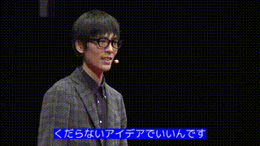

# stenocaptioner

Automatic subtitling tool using whisper.

## Dependencies

* [whisper](https://github.com/openai/whisper)
* [moviepy](https://github.com/Zulko/moviepy)
* [youtube_dl](https://github.com/ytdl-org/youtube-dl)

## Installation

### Ubuntu

```sh
sudo apt-get -y install imagemagick fonts-vlgothic
```

You will also need to modify the ImageMagick configuration file to comment out the following policy.

```
sudo vi /etc/ImageMagick-6/policy.xml
  <!--
  <policy domain="path" pattern="@*" rights="none">
  -->
```

Install with pip.

```sh
pip install git+https://github.com/openai/whisper.git
pip install stenocaptioner
```

## Usage

You can give the url of youtube video as an argument.

```sh
stenocaptioner https://www.youtube.com/watch?v=ldybnuFxdiQ --language ja
```

### Original video


### Basic Result


### Background color



### Contour


### Font

https://fontfree.me/3132


### Effect (typing)


### Effect (arrive)


### Effect (cascade)


